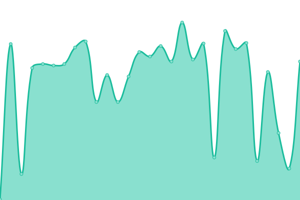

# [📈 Live Status](https://BYWled.github.io/status): <!--live status--> **🟥 Complete outage**

This repository contains the open-source uptime monitor and status page for [BYWled](https://BYWled.github.io/status), powered by [Upptime](https://github.com/upptime/upptime).

With [Upptime](https://upptime.js.org), you can get your own unlimited and free uptime monitor and status page, powered entirely by a GitHub repository. We use [Issues](https://github.com/BYWled/status/issues) as incident reports, [Actions](https://github.com/BYWled/status/actions) as uptime monitors, and [Pages](https://BYWled.github.io/status) for the status page.

<!--start: status pages-->
<!-- This summary is generated by Upptime (https://github.com/upptime/upptime) -->
<!-- Do not edit this manually, your changes will be overwritten -->
<!-- prettier-ignore -->
| URL | Status | History | Response Time | Uptime |
| --- | ------ | ------- | ------------- | ------ |
|  [🌐 博客（主站）](https://www.wled.top) | 🟥 Down | [.yml](https://github.com/BYWled/wled-status/commits/HEAD/history/.yml) | 

 289ms
     
 | 

<a href="https://BYWled.github.io/wled-status/history/">0.99%</a>
    

|  [🛒 乐购商城](https://store.wled.top) | 🟥 Down | [.yml](https://github.com/BYWled/wled-status/commits/HEAD/history/.yml) | 

 289ms
     
 | 

<a href="https://BYWled.github.io/wled-status/history/">0.83%</a>
    

|  [🛠️ 后台管理系统](https://admin.wled.top) | 🟥 Down | [.yml](https://github.com/BYWled/wled-status/commits/HEAD/history/.yml) | 

 289ms
     
 | 

<a href="https://BYWled.github.io/wled-status/history/">0.96%</a>
    

|  [📊 状态监控](https://status.wled.top/status) | 🟥 Down | [.yml](https://github.com/BYWled/wled-status/commits/HEAD/history/.yml) | 

 289ms
     
 | 

<a href="https://BYWled.github.io/wled-status/history/">0.79%</a>
    

|  [🌐 博客（主站） - Github镜像](https://mirror.wled.top) | 🟥 Down | [github.yml](https://github.com/BYWled/wled-status/commits/HEAD/history/github.yml) | 

 241ms
     
 | 

<a href="https://BYWled.github.io/wled-status/history/github">0.05%</a>
    

|  [🛒 乐购商城 - Github镜像](https://mirror-store.wled.top) | 🟥 Down | [github.yml](https://github.com/BYWled/wled-status/commits/HEAD/history/github.yml) | 

 241ms
     
 | 

<a href="https://BYWled.github.io/wled-status/history/github">0.00%</a>
    

|  [🛠️ 后台管理系统 - Github镜像](https://mirror-admin.wled.top) | 🟥 Down | [github.yml](https://github.com/BYWled/wled-status/commits/HEAD/history/github.yml) | 

 241ms
     
 | 

<a href="https://BYWled.github.io/wled-status/history/github">0.00%</a>
    

|  [📊 状态监控 - Github（本页面）](https://mirror-status.wled.top) | 🟥 Down | [github.yml](https://github.com/BYWled/wled-status/commits/HEAD/history/github.yml) | 

 241ms
     
 | 

<a href="https://BYWled.github.io/wled-status/history/github">0.11%</a>
    

<!--end: status pages-->

[**Visit our status website →**](https://BYWled.github.io/status)

## 📄 License

- Powered by: [Upptime](https://github.com/upptime/upptime)
- Code: [MIT](./LICENSE) © [Anand Chowdhary](https://anandchowdhary.com), supported by [Pabio](https://pabio.com)
- Data in the `./history` directory: [Open Database License](https://opendatacommons.org/licenses/odbl/1-0/)
